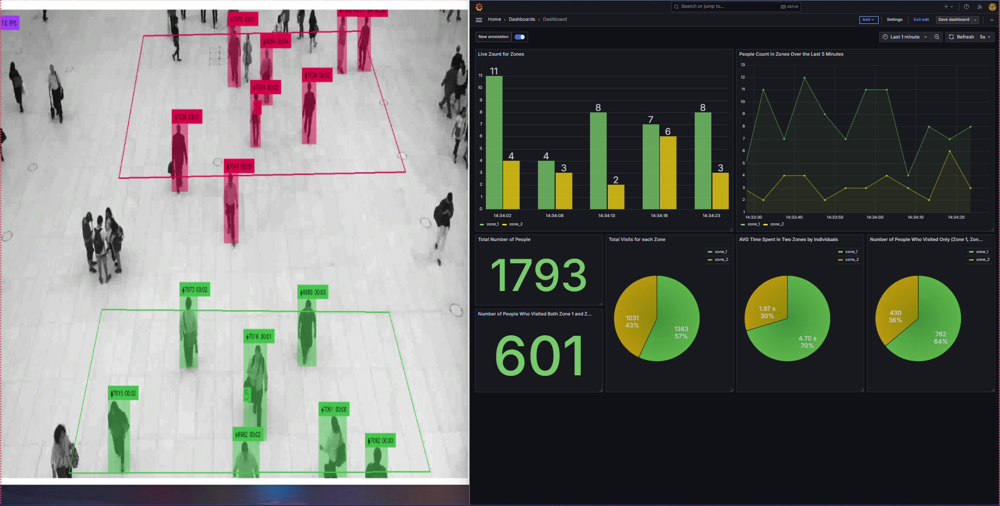

# AI-Powered People Movement Analysis Using Computer Vision

## 📌 Project Overview
This project is an AI-powered system designed to analyze the movement of people in different spaces using advanced computer vision techniques. The system is capable of real-time people tracking, zone-based movement analysis, and data visualization to help optimize space management in areas such as retail stores, airports, public squares, and commercial buildings.

## 📷 Project Screenshots

## 🎯 Objectives
- Provide **real-time analytics** on people movement.
- Identify **high-traffic zones** and congestion points.
- Enable **data-driven decision-making** for space management.
- Enhance **customer experience** and operational efficiency.

## 🔧 Technologies Used
- **Programming Language**: Python
- **Computer Vision**: YOLO (You Only Look Once) for object detection
- **Object Tracking**: ByteTrack for robust person tracking
- **Video Streaming**: RTSP for live video feed integration
- **Zone Analysis**: Supervision library for polygon-based zone detection
- **Database**: PostgreSQL for structured data storage
- **Data Visualization**: Grafana for real-time analytics and dashboard representation

## 🛠 How the System Works
### 1️⃣ **Video Stream Processing**
- The system captures live video feeds from installed **RTSP-enabled** cameras.
- It dynamically adjusts the frame rate based on processing capacity to maintain real-time performance.

### 2️⃣ **People Detection & Tracking**
- Uses **YOLO** for detecting individuals in each video frame.
- Each detected person is assigned a unique ID using **ByteTrack** to track movement across frames.

### 3️⃣ **Zone-Based Movement Analysis**
- Space is divided into zones using **polygon-based** region mapping (Supervision library).
- The system monitors:
  - Number of people in each zone.
  - Entry and exit times for each individual.
  - Total time spent in each zone.

### 4️⃣ **Database Logging & Storage**
The data is structured and stored in **PostgreSQL** with three primary tables:
- `zone_in`: Logs the entry of a person into a zone (Person ID, Zone ID, Timestamp).
- `zone_out`: Logs the exit of a person from a zone (Person ID, Zone ID, Timestamp).
- `zones`: Stores the real-time count of people present in each zone.

### 5️⃣ **Real-Time Dashboard & Analytics**
- Integrated with **Grafana** to provide interactive visual analytics.
- Key insights available:
  - **Live people count** in each zone.
  - **Total foot traffic** since system start.
  - **Traffic distribution** across different zones.
  - **Average dwell time** per zone.
  - **Transition trends** between zones.

## 🚀 Benefits & Use Cases
✅ **Retail Stores**: Understand customer movement patterns, optimize store layout.
✅ **Airports & Public Spaces**: Monitor congestion and improve crowd flow.
✅ **Commercial Buildings**: Track occupancy levels and optimize workspace management.
✅ **Event Management**: Identify high-traffic areas for better crowd control.
